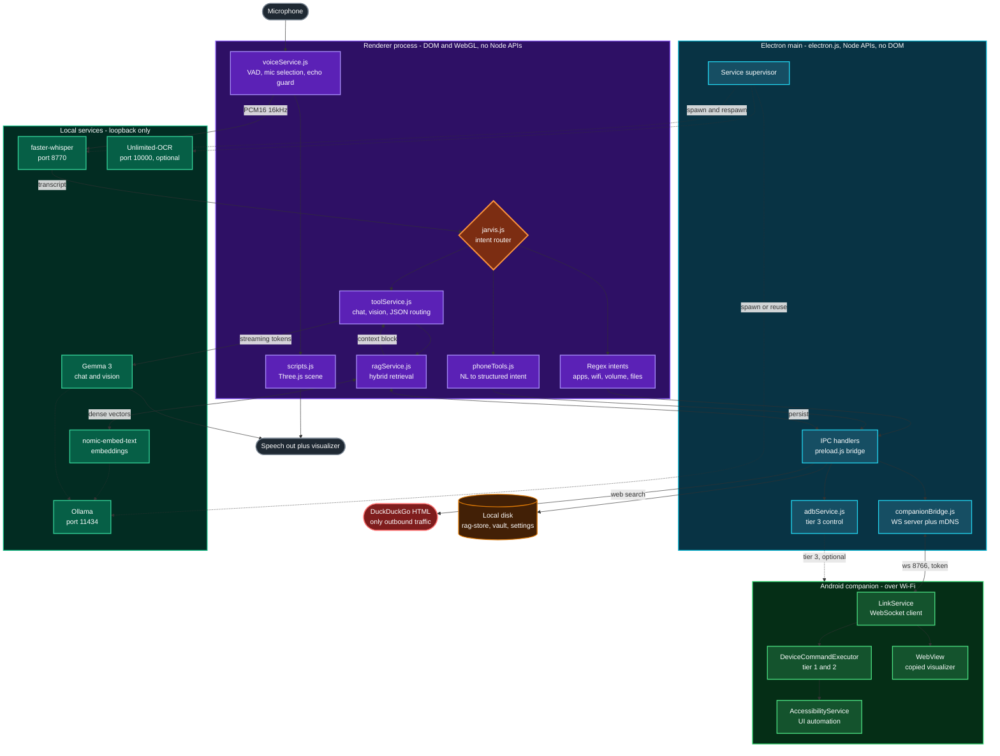
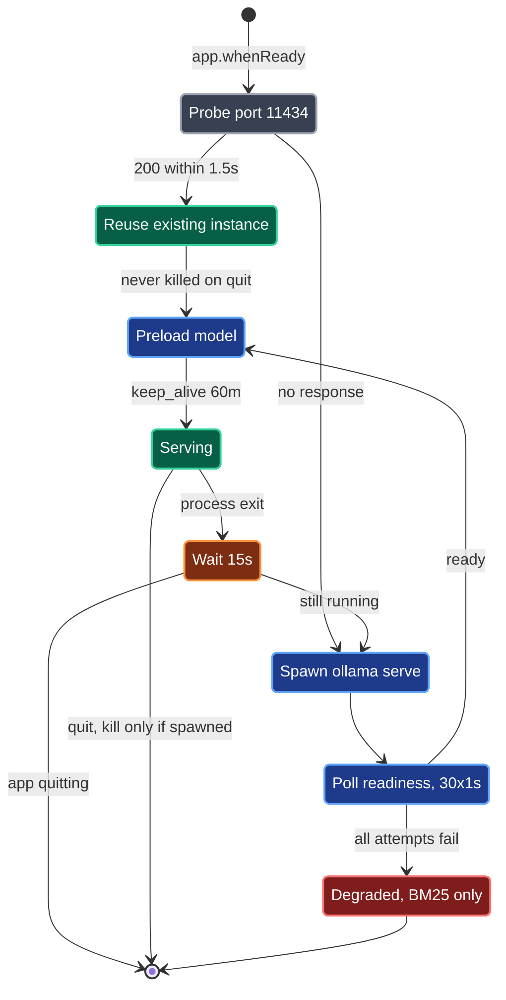
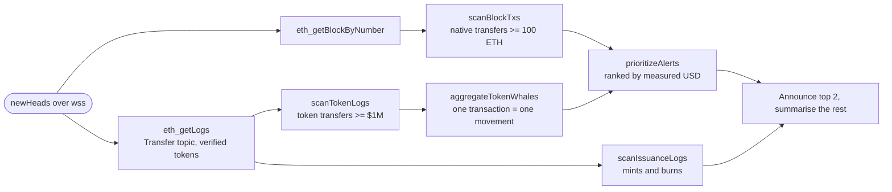
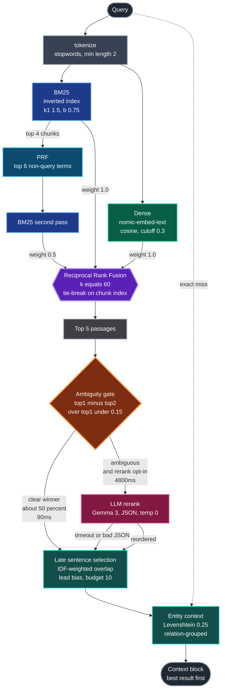

# JARVIS - Local-First Desktop Assistant

<p align="center">
  
  
  
  
  
</p>

<p align="center">
  
  
  
  
  
</p>

<p align="center">
  
  
  
  
  
</p>

<p align="center">
  
  
  
  
</p>

JARVIS is a desktop assistant whose intelligence runs entirely on your own
machine. Speech recognition, language understanding, retrieval, and vision all
execute locally. No model API keys, no network calls to a model provider, and no
conversation data leaving the device.

Some features ask the outside world for facts it alone has — a share price, a
headline, the state of a blockchain. Those calls send a ticker or an address and
nothing else: no transcript, no memory, no conversation. Everything else works
with the network unplugged.

It presents as a frameless, transparent 3D visualizer that floats above your
desktop, listens continuously, and answers by voice. A companion Android app
extends the same interface and control surface to a paired phone over Wi-Fi.

---

## Contents

- [What makes this different](#what-makes-this-different)
- [Architecture](#architecture)
- [Feature reference](#feature-reference)
- [On-chain intelligence](#on-chain-intelligence)
- [Retrieval engine](#retrieval-engine)
- [Android companion](#android-companion)
- [Installation](#installation)
- [Running](#running)
- [Configuration](#configuration)
- [Network ports](#network-ports)
- [Project layout](#project-layout)
- [Troubleshooting](#troubleshooting)
- [Known limits](#known-limits)

---

## What makes this different

Most assistants send your microphone to a datacenter. This one does not.

| Capability | Typical assistant | JARVIS |
| --- | --- | --- |
| Speech to text | Cloud ASR | faster-whisper, local |
| Language model | Hosted API | Gemma 3 via Ollama, local |
| Embeddings | Hosted API | nomic-embed-text, local |
| Vision / screen reading | Cloud vision | Gemma 3 multimodal, local |
| Conversation storage | Provider servers | Local disk only |
| Works without internet | No | Yes, except live data lookups |
| Per-query cost | Metered | Zero |

Outbound traffic is limited to fact lookups that cannot be answered locally:
keyless web search when a query is search-shaped, quote and news endpoints, and
blockchain RPC. Each sends only the subject of the question — a ticker, a
search string, an address. Inference never leaves the machine.

---

## Architecture

### System overview



| Colour | Layer |
| --- | --- |
| Purple | Renderer. Visualizer, voice loop, retrieval, intent routing |
| Cyan | Electron main. Service supervision, IPC, LAN listeners |
| Green | Local inference. Everything bound to loopback |
| Light green | Android companion, reached over Wi-Fi |
| Red | External network. The single outbound path |
| Amber | Local persistence |

The Electron main process (`electron.js`) supervises every local service and
restarts them on failure. The renderer owns the visualizer, voice loop, and
retrieval.

### Voice pipeline

```mermaid
flowchart LR
    A(["Microphone"]):::io --> B["_pickMicDevice<br/>excludes loopback<br/>ranks headset, internal"]:::step
    B --> C["AudioContext graph<br/>highpass 80Hz<br/>compressor"]:::step
    C --> D["Analyser<br/>FFT bands"]:::viz
    C --> E["capture-processor<br/>PCM16 16kHz"]:::step
    D -->|"bass, mid, treble"| F["Three.js orb<br/>vertex displacement"]:::viz

    E --> G{"Adaptive VAD<br/>3x noise floor"}:::gate
    G -->|"below threshold"| H["Discard"]:::drop
    G -->|"speech detected"| I["Buffer<br/>320ms preroll<br/>1.44s hangover"]:::step
    I --> J["faster-whisper<br/>ws 8770"]:::ai
    J --> K{"Echo guard<br/>60 percent overlap<br/>with spoken text"}:::gate
    K -->|"self-talk"| L["Drop, show ECHO IGNORED"]:::drop
    K -->|"user speech"| M["processCommand"]:::router
    M --> N["Streaming TTS<br/>speak per sentence"]:::step
    N -.->|"sets ttsActive<br/>gates mic"| G
    N -.->|"_rememberSpoken"| K

    classDef io fill:#1f2933,stroke:#7b8794,stroke-width:2px,color:#ffffff
    classDef step fill:#5b21b6,stroke:#a78bfa,stroke-width:2px,color:#ffffff
    classDef gate fill:#7c2d12,stroke:#fb923c,stroke-width:3px,color:#ffffff
    classDef ai fill:#065f46,stroke:#34d399,stroke-width:2px,color:#ffffff
    classDef viz fill:#0c4a6e,stroke:#38bdf8,stroke-width:2px,color:#ffffff
    classDef drop fill:#450a0a,stroke:#ef4444,stroke-width:2px,color:#ffffff
    classDef router fill:#134e4a,stroke:#2dd4bf,stroke-width:2px,color:#ffffff
```



Two feedback loops are load-bearing. The dashed edges back into the VAD and echo
guard are what stop JARVIS transcribing its own voice, and both are required:
the `ttsActive` gate leaks because synthesised audio bypasses Chromium echo
cancellation, so the text-level guard catches what the gate misses.

### Process supervision



Two invariants are encoded above. **Only kill what you spawned:** an Ollama the
user started is reused and left running on quit. **Preload is not optional:**
Ollama's default `keep_alive` is 5 minutes, so without the 60-minute preload the
first question after any idle period pays a multi-second cold load.

On launch, `electron.js` starts and monitors:

| Service | Behaviour on failure |
| --- | --- |
| Ollama | Reuses an existing instance if one is running; otherwise spawns `ollama serve`, waits for readiness, preloads the model with `keep_alive: 60m`, and auto-respawns after 15s |
| faster-whisper STT | Auto-respawns after 15s; port conflicts exit harmlessly |
| Phone bridge | Token-authenticated HTTP listener |
| Companion bridge | WebSocket server plus mDNS advertisement |
| Downloads watcher | chokidar; new documents are OCR'd and ingested |
| Clipboard monitor | Scans for leaked secrets, reports masked hints only |
| Active window tracker | 10s cadence |
| Finance service | 60s quote cadence |

Services that JARVIS spawns are terminated on quit. Services it merely reused,
such as an Ollama you started yourself, are left running.

---

## Feature reference

### Voice

Open conversation mode. Every transcript is routed and answered; no wake word
is required. Leading "Jarvis" and common mis-hearings are stripped.

- Always-on microphone with adaptive noise-floor VAD
- Deliberate microphone selection, excluding loopback devices such as Stereo Mix
  which would otherwise capture JARVIS listening to itself
- Streaming speech: each completed sentence is spoken during token generation,
  cutting time-to-first-word from roughly 5-10s to 1-2s
- Echo guard using word-overlap against recently spoken text, because the
  synthesis-active flag alone is known to leak
- Self-healing microphone recovery with a 5s watchdog for eventless device death

### Visualizer

- Icosahedron with Perlin-noise vertex displacement driven by live FFT
- Bass, mid, and treble bands weighted separately
- Frequency-mapped colour, with time-based hue cycling when idle
- Transparent frameless window that floats over other applications
- F2 toggles between orb-only and full HUD

### System control

- Application launch through an allowlist
- Volume, brightness, media keys, power state
- Wi-Fi scan, connect to saved profiles, disconnect, and measured link
  diagnostics reporting real latency and packet loss
- File operations, clipboard read and write
- Windows Settings deep links
- Live CPU, RAM, uptime, and active window telemetry in the HUD

### Screen and documents

- Screen reading through Gemma 3 vision, fully offline. The captured question is
  passed through, so "what error is showing" reaches the model intact
- Optional Unlimited-OCR server for dense text
- Downloads are watched, OCR'd, and ingested into memory automatically

### Knowledge

- Hybrid retrieval over local memory, detailed below
- Keyless web search with a three-provider failover chain — DuckDuckGo HTML,
  DuckDuckGo Instant Answer, then Wikipedia — injected as cited context for
  search-shaped queries. The chain exists because the HTML endpoint starts
  serving a captcha once an IP is flagged, which silently emptied every result
- Finance watchlist with crossing alerts. Read-only by design: no order
  placement code exists anywhere in the project

### Markets and quantitative analysis

Every number here is computed by tested code from measured data. The language
model is never asked to calculate a financial figure, because it cannot be
trusted with one and a wrong figure stated confidently is worse than no answer.

- Live quotes with day change, resolved name to ticker
- Deterministic risk analytics in `src/js/services/quant.js`: annualised return,
  volatility, Sharpe, Sortino, maximum drawdown, beta and alpha against a
  benchmark, correlation, and Black-Scholes pricing with greeks
- Headlines from Google News with Bing failover, keyless

---

## On-chain intelligence

Read-only by construction. Only a hard allowlist of JSON-RPC read methods is
ever sent; there is no signing code, no transaction construction, and no private
key handling anywhere in the project.

The governing rule is the same one the quant engine follows: **the chain is the
source of truth, and anything the chain cannot prove is not claimed.** An
address with no ENS name stays an address. No exchange or entity is ever named
from a guess.

### Address and contract reads

- Native and ERC-20 balances, gas, nonce, across Ethereum, Arbitrum, Base,
  Optimism, Polygon and BNB Chain
- ENS forward and reverse resolution, implemented from a pure keccak-256 in
  `src/js/services/keccak.js` and verified against public vectors
- Transaction decode: status, native value, and every ERC-20/721 Transfer in the
  receipt, resolved to symbols and exact decimal amounts
- Contract classification through ERC-165 `supportsInterface` and an ERC-20
  probe. Classification only; this is not a vulnerability auditor
- Cross-chain portfolio. With an Alchemy key this returns everything a wallet
  holds, priced; without one it falls back to scanning known tokens per chain
- Solana wallet assets and recent activity through Helius, including native SOL
  balance and USDC/USDT supply

### Real-time whale stream

A websocket subscription to new block headers. Each confirmed block is scanned
for large movements, and everything announced is a fact read out of that block.



- **Token flows, not just native.** Most large value on Ethereum moves as
  stablecoins. Sampled over five live blocks: 0-2 native ETH whales versus 16
  token movements
- **Token decimals are verified on chain** with a `decimals()` call before any
  amount is decoded. Reading a 6-decimal token as 18 turns $4M into $4
- **One transaction is one movement.** An arbitrage route through several pools
  emits the same tokens repeatedly; a live drill caught the same 14,050 WETH
  being announced three times. Transfers are now grouped per transaction, the
  source is the address that only sends, the destination the one that only
  receives, and the hop count and any round trip are stated
- **Ranked across assets by measured USD.** 100 ETH has more raw units than
  4,000,000 USDC, so unit ordering picks the wrong headline
- **Stablecoin issuance.** A mint is a Transfer from the zero address and a burn
  is one to it, so supply changes need no label database. Live-verified against
  mainnet: a 5,414,317 USDC mint, and in one hour DAI net +6.9M against USDC net
  -6.0M
- **Address context on both ends**: ENS name, contract or wallet via
  `eth_getCode`, transactions sent, ETH held. The display carries full addresses
  and the transaction hash; speech carries the readable form
- **Operational hardening**: exponential backoff with jitter, 30s heartbeat and
  90s silence detection, gap detection with in-order backfill through the same
  code path as live blocks, and bounded dedup so memory stays flat

### What is deliberately not built

| Asked for | Why not |
| --- | --- |
| Exchange labels ("from Binance") | Not on-chain data. It requires a proprietary attribution database; naming a wallet on a guess is the one thing that would make these alerts untrustworthy. Arkham is supported *with your own key*, and its labels are spoken attributed |
| Wallet classification by the model | A 4B model producing "institutional accumulator" is a confabulated verdict, not analysis |
| Mempool alerts | Pending transactions get dropped and replaced. An alert about a transaction that never lands is misinformation |
| Global Solana whale scanning | Measured: the Helius socket delivers over 200 token-program events in 15 seconds. Filtering that firehose is not something this machine does while also running voice |
| Bitcoin monitoring | A different data source entirely, and none is connected |

### Provider keys

All optional. JARVIS runs keyless and degrades honestly, saying which chains it
can read and why one is missing.

| Key | Unlocks | Without it |
| --- | --- | --- |
| `ALCHEMY_API_KEY` | Full wallet holdings with prices, faster RPC, keyed websocket | Public endpoints, known-token scanning only |
| `HELIUS_API_KEY` | Solana wallets, activity, stablecoin supply | No Solana |
| `DUNE_API_KEY` | Aggregate analytics: top holders, USD-priced flows | Those queries state the key is needed |
| `ARKHAM_API_KEY` | Entity labels, spoken with attribution | Addresses stay addresses |

Networks are **discovered, not assumed**: each candidate endpoint must return
the chain ID it claims before it is used. On the free Alchemy tier this
correctly rejects Optimism and Polygon, which answer 403, rather than failing
later with a confusing error.

Measured provider limits that shape the design: Alchemy's free tier caps
`eth_getLogs` at 10 blocks, 1rpc at 50, and drpc handles a few hundred but
refuses under load. Wide-range log queries are therefore chunked at 50 blocks
across the keyless pool, and any chunk that fails is reported rather than
silently dropped — "nothing happened this hour" and "I could only read half the
hour" are different answers.

### Fund tracing

`src/js/services/tracer.js` implements the deterministic Approximate
Personalized PageRank from the TRacer paper, with its tracing-tendency and
weighted-pollution strategies, plus structural pattern detection (amount
consistency, cycles, consistent chains). It reports pattern presence, never a
verdict. The algorithm is tested and works; live tracing needs address history,
which public RPC cannot enumerate, so it awaits an Etherscan-family key.

---

## Retrieval engine

`src/js/services/ragService.js` implements hybrid retrieval. Design choices are
evidence-driven and each is traceable to a measurement or a paper.



### Components

| Stage | Implementation | Rationale |
| --- | --- | --- |
| Sparse | BM25 over a persistent inverted index, incremental on ingest | Re-tokenising the corpus per query measured 94ms at 5k chunks on the render thread |
| Dense | nomic-embed-text through Ollama, cosine similarity | Degrades to BM25-only when no embedder is present |
| Fusion | Reciprocal Rank Fusion, k=60 | Hybrid beat dense-only and sparse-only for every embedding model in PubHealthBench |
| Expansion | PRF: top 4 chunks, top 6 non-query terms, fused as a separate list at weight 0.5 | Kept separate so a poor feedback pool can dilute but not corrupt the original ranking |
| Entities | Normalised Levenshtein, threshold 0.25, after exact-match miss | Input is speech-to-text, so names arrive mangled |
| Selection | Late sentence selection, IDF-weighted overlap with lead bias, budget 10 | LongEval's winning system paired plain passages with late sentence selection |
| Reranking | Ambiguity-gated LLM rerank, opt-in | See below |

### Measured results

Inverted index against the previous implementation, top-10 rankings verified
bit-identical at every size:

| Corpus | Before | After | Speedup |
| --- | --- | --- | --- |
| 100 chunks | 1.87 ms | 0.008 ms | 223x |
| 500 chunks | 8.71 ms | 0.037 ms | 238x |
| 2,000 chunks | 37.1 ms | 0.116 ms | 319x |
| 5,000 chunks | 104.8 ms | 0.456 ms | 230x |

Late sentence selection, measured end to end on real document text:

| Metric | Result |
| --- | --- |
| Context size reduction | 81 percent, 11,396 to 2,192 characters |
| Correct evidence position | ranks 1 to 3 |
| Determinism across repeated calls | byte-identical |

### On reranking

Ollama exposes no `/api/rerank` endpoint, so a conventional cross-encoder is not
available. Gemma 3 can rerank correctly, scoring 3 of 3 top-1 on labelled
passages, but a single call costs roughly 3 seconds.

Reranking is therefore gated on ambiguity and is opt-in rather than default:

| Path | Frequency | Latency |
| --- | --- | --- |
| Gate skips, top-1 clearly dominant | ~50 percent | ~90 ms |
| Gate fires, candidates close | ~50 percent | ~4,800 ms |

Typed input opts in. Voice input does not, because roughly 5 seconds of added
silence is unacceptable on the spoken path. Any timeout or malformed response
falls back to lexical order, so reranking is an enhancement and never a
dependency.

### Why not agentic retrieval

A-RAG style agentic retrieval was evaluated and deliberately not adopted.
Benchmarked on this hardware, Gemma 3 routes queries to the correct source with
92 percent accuracy, which is sufficient. The blocker is latency: a single
planning call costs about 3 seconds, and the published agent loops use 5 to 20
steps. That is 15 to 60 seconds of silence before the first word, which does not
work for a voice interface.

---

## Android companion

`companion/` contains a Kotlin application that mirrors the visualizer to a
phone and exposes device control back to the desktop.

<p align="left">
  
  
  
  
</p>

### The visualizer is copied, not reimplemented

| Asset | Origin | State |
| --- | --- | --- |
| `visualizerModes.js` | `src/js/visualizerModes.js` | byte-identical, SHA-256 verified |
| `three.module.js` | three@0.158.0 | byte-identical |
| Vertex and fragment shaders | `src/index.html` | verbatim |
| `visualizer.js` | `src/js/scripts.js` | renderer, uniforms, and FFT blend preserved |

`visualizerModes.js` still carries `import * as THREE from 'three'`. Rather than
edit the copy, an import map in the host page resolves the bare specifier, so
the file stays identical to the desktop original.

Assets are served through `WebViewAssetLoader` on a virtual https origin rather
than `file://`. WebView blocks ES module scripts from `file://` because the
origin is opaque, which presents as a silent black screen.

### Audio bridge

The desktop fills `window.jarvisFrequencyData` from a WebAudio AnalyserNode. A
WebView cannot obtain microphone access that way, so `AudioFft.kt` reads
`AudioRecord`, applies a Hann window, runs a radix-2 FFT, and writes the same 64
bins natively. Bins use WebAudio's decibel mapping, minus 100 to minus 30 dB
onto 0 to 255. Linear magnitude was tried and leaves the orb nearly static at
speaking volume.

### Pairing

```mermaid
sequenceDiagram
    autonumber
    actor U as User
    participant D as Desktop<br/>electron.js
    participant B as Bridge<br/>port 8765
    participant P as Phone<br/>LinkService
    participant W as WebSocket<br/>port 8766

    rect rgb(46, 16, 101)
    Note over U,D: Onboarding, once per device
    U->>D: "Jarvis, connect to my mobile"
    D->>B: openPairingWindow, 5 minutes
    D-->>U: QR code on HUD
    U->>P: scan with camera
    P->>B: GET /install
    B-->>P: landing page
    P->>B: GET /apk
    B-->>P: app-debug.apk
    U->>P: tap Install, then open
    end

    rect rgb(2, 44, 34)
    Note over P,W: Discovery and pairing, automatic
    P->>P: NSD discover _jarvis._tcp
    B-->>P: resolved, filtered addresses
    Note right of P: drops 169.254.x<br/>and 192.168.56.x
    P->>B: POST /pair
    alt window still open
        B-->>P: 200 token plus wsPort
    else window closed
        B-->>P: 403 pairing window is closed
        Note right of P: retry every 10s
    end
    end

    rect rgb(8, 51, 68)
    Note over P,W: Persistent link
    P->>W: connect, X-Jarvis-Token
    W->>W: timingSafeEqual
    alt token valid
        W-->>P: accepted
        P->>W: hello plus capabilities
        W-->>D: companion-devices event
        D-->>U: "Linked: Xiaomi M2101K6P"
    else token invalid
        W-->>P: close 4001
    end
    end

    rect rgb(19, 78, 74)
    Note over U,W: Steady state
    U->>D: "open settings on my phone"
    D->>D: routePhoneCommand
    D->>W: id, open_app_by_name, name settings
    W->>P: forward
    P->>P: resolve name to package
    P-->>W: ok, com.android.settings
    W-->>D: result
    D-->>U: "Settings is now open on your phone, Sir."
    end

    Note over P,W: on disconnect, reconnect with<br/>exponential backoff capped at 30s
```



The phone always dials outward, which avoids Doze restrictions and handset
address churn. Pairing retries every 10 seconds while unpaired, because the
window is usually opened after discovery has already resolved.

`/pair` and `/apk` return 403 once the window closes. That window is the only
thing standing between a network neighbour and the bridge token, so it is short
and user-initiated.

### Capability negotiation

On connect the phone reports what it can actually do, probed rather than
assumed:

```json
{"open_app":true,"list_apps":true,"clipboard":true,"battery":true,
 "tts":true,"flashlight":true,"volume":true,
 "ui_automation":false,"screenshot":false,"read_screen":false,
 "silent_install":false}
```

The desktop reasons about the device instead of firing commands blindly. A
request needing accessibility explains how to enable it rather than failing
opaquely.

### Control tiers

| Tier | Requires | Commands |
| --- | --- | --- |
| 1 | Nothing beyond install | `ping`, `device_info`, `battery`, `clipboard_get`, `clipboard_set`, `tts`, `list_apps`, `open_app_by_name`, `flashlight`, `volume`, `capabilities` |
| 2 | AccessibilityService enabled | `get_layout`, `click`, `long_press`, `swipe`, `input_text`, `global`, `screenshot` |
| 3 | Wireless Debugging enabled | Desktop-side ADB: brightness, volume, keyevents, package management, file transfer, screenrecord |

Tier 3 runs entirely on the desktop through `adbService.js`. The APK is not
involved. All ADB invocations pass argument arrays, never concatenated strings,
and raw shell passthrough is disabled at the IPC boundary.

### Structured phone tools

The desktop reasons; the phone executes. Commands travel as structured intents,
never free-form text:

```
"open settings on my phone"
  -> routePhoneCommand()
  -> {tool: "phone.open_app", parameters: {name: "settings"}}
  -> companion: open_app_by_name
  -> {"package": "com.android.settings", "label": "Settings"}
  -> "Settings is now open on your phone, Sir."
```

Every spoken confirmation is built from what the phone returned. The language
model is deliberately absent from this path, because earlier logs showed it
inventing outcomes when it had no execution feedback.

---

## Installation

### Prerequisites

| Requirement | Version | Purpose |
| --- | --- | --- |
| Node.js | 18 or higher | Runtime and build |
| Ollama | any current | Local model serving |
| uv | any current | Isolated Python environment for STT |
| JDK | 17 or higher | Companion app only |
| Android SDK | platform 35, build-tools 35 | Companion app only |

### Desktop

```bash
npm install

ollama pull gemma3:4b
ollama pull nomic-embed-text

npm run build
```

Ollama does not need to be running. JARVIS starts it if the port is idle and
preloads the model so the first question does not pay a cold-load penalty.

### Companion app

```bash
cd companion
./gradlew assembleDebug
```

The APK is written to `app/build/outputs/apk/debug/app-debug.apk` and served
automatically during pairing.

---

## Running

```bash
npm run electron
```

This runs the production build from `dist/`. For live reload while editing the
renderer, run the Vite server and the development launcher in separate shells:

```bash
npm run dev
npm run electron:dev
```

Do not use `electron:dev` without `npm run dev` running, as it expects a server
on port 5173.

### Scripts

| Command | Effect |
| --- | --- |
| `npm run dev` | Vite dev server on port 5173 |
| `npm run build` | Production bundle into `dist/` |
| `npm run electron` | Launch against `dist/` |
| `npm run electron:dev` | Launch against the Vite server |
| `npm run electron:build` | Build a Windows NSIS installer into `release/` |

---

## Configuration

Settings live in browser local storage and are seeded from
`src/js/settings.js`. Relevant defaults:

| Key | Default | Meaning |
| --- | --- | --- |
| `llmProvider` | `gemma-local` | Local inference through Ollama |
| `localOllamaUrl` | `http://localhost:11434` | Ollama endpoint |
| `localModel` | `gemma3:4b` | Generation and vision model |
| `micPreference` | `auto` | `headset`, `internal`, or `auto` |
| `echoCancellation` | `true` | Stops JARVIS hearing itself |
| `noiseSuppression` | `true` | Filters fans and keystrokes |
| `autoGainControl` | `true` | Required for quiet microphones |
| `ocrProvider` | `auto` | Local OCR server when available |

### Environment overrides

The main process cannot read renderer local storage at boot, so these are
available as environment variables:

| Variable | Default |
| --- | --- |
| `JARVIS_OLLAMA_URL` | `http://localhost:11434` |
| `JARVIS_LOCAL_MODEL` | `gemma3:4b` |
| `JARVIS_OCR_URL` | `http://127.0.0.1:10000` |
| `JARVIS_ADB_PATH` | auto-detected |
| `JARVIS_ETH_WS` | keyed endpoint if available, else `wss://ethereum-rpc.publicnode.com` |

### Provider keys and `.env`

Copy `.env.example` to `.env` and fill in whatever you have. Every key is
optional; see [Provider keys](#provider-keys) for what each unlocks. The file is
git-ignored, values are never logged (only the key *names* appear at startup),
and a real environment variable always wins over the file.

```bash
cp .env.example .env
```

```
ALCHEMY_API_KEY=      # EVM RPC, portfolio, prices
HELIUS_API_KEY=       # Solana RPC, assets, activity
# DUNE_API_KEY=       # aggregate analytics
# ARKHAM_API_KEY=     # entity labels, spoken with attribution
```

At startup the log states exactly what was found and what it can reach:

```
[env] loaded keys: ALCHEMY_API_KEY, HELIUS_API_KEY
[chain] Alchemy verified in 394ms: arbitrum, ethereum, base, bsc | unavailable: optimism, polygon
```

### Credentials

Secrets are held in an Electron `safeStorage` vault backed by Windows DPAPI. The
renderer can set, list, and delete entries but can never read raw values. The
typed command `store key <name> <value>` bypasses the model and conversation
memory entirely. Provider keys can live here instead of `.env`, and the
environment is checked first.

---

## Network ports

All listeners bind locally or to the LAN. None are exposed to the internet.

| Port | Service | Bind | Authentication |
| --- | --- | --- | --- |
| 8765 | Phone bridge HTTP | `0.0.0.0` | Bearer token, except the pairing routes |
| 8766 | Companion WebSocket | `0.0.0.0` | Token in `X-Jarvis-Token`, constant-time compare |
| 8770 | faster-whisper STT | `127.0.0.1` | Loopback only |
| 11434 | Ollama | `127.0.0.1` | Loopback only |
| 10000 | Unlimited-OCR, optional | `127.0.0.1` | Loopback only |
| 5173 | Vite dev server | `127.0.0.1` | Development only |

---

## Project layout

```
electron.js              Main process. Service supervision, IPC, OS integration
preload.js               Context-isolated IPC surface
companionBridge.js       Companion WebSocket server and mDNS advertisement
adbService.js            Tier 3 wireless ADB control

                         Root CommonJS modules. Main cannot import the
                         renderer's ES modules, so pure logic it needs lives
                         here and is unit-tested from src/js/services/__tests__.
chainProviders.js        Keyed provider layer, chain-ID probe and discovery
chainWatch.js            Whale, token flow, issuance and aggregation logic
rpcHedge.js              Hedged endpoint racing with sticky last-good ordering
streamGuard.js           Backoff, dedup, block-gap tracking, alert priority
metricStore.js           Telemetry persistence, rollups, threshold events

src/
  index.html             HUD markup, GLSL shaders, styles
  config.js              Local credentials, gitignored
  js/
    scripts.js           Three.js scene, render loop, FFT blend
    visualizerModes.js   Sphere, cube, particles, torus, colour mapping
    jarvis.js            Intent router, command handlers, speech
    settings.js          Defaults and persistence
    memory.js            Conversation history
    toolService.js       Ollama chat, vision, JSON action routing
    liveService.js       Cloud session, dormant without a key
    microphone.js        Capture graph
    screenCapture.js     Screen capture and OCR bridge
    calendar.js          Reminders and scheduling
    services/
      voiceService.js    VAD, mic selection, STT transport
      ragService.js      Hybrid retrieval engine
      phoneTools.js      Natural language to structured phone intents
      quant.js           Deterministic financial mathematics
      onchain.js         BigInt units, calldata encoding, chain and token maps
      chainIntel.js      Provider payload parsing, portfolio and Solana output
      ens.js, keccak.js  ENS resolution over a pure keccak-256
      tracer.js          Fund tracing, personalized PageRank, patterns
      ondoRegistry.js    Tokenized-security catalogue and query parsing
      groundingGuard.js  Blocks invented identifiers before they are spoken
      factStore.js       Belief memory with confidence and revision
      __tests__/         934 checks across 24 suites, run with plain node
    capture-processor.js AudioWorklet, capture
    playback-processor.js AudioWorklet, playback

server/
  stt-server.py          faster-whisper WebSocket server

companion/               Android companion, Gradle Kotlin DSL
  app/src/main/
    java/com/jarvis/companion/
      MainActivity.kt              WebView host, permissions, JS bridge
      audio/AudioFft.kt            AudioRecord, Hann window, radix-2 FFT
      data/Prefs.kt                Pairing state
      network/DesktopLink.kt       WebSocket client, reconnect with backoff
      network/NsdDiscoveryHelper.kt mDNS discovery
      network/CommandExecutor.kt   Command contract
      services/LinkService.kt      Foreground service, pairing retry loop
      services/DeviceCommandExecutor.kt  Command implementations
      services/JarvisAccessibilityService.kt  Tier 2 automation
    assets/visualizer/     Copied desktop visualizer

docs/
  OCR-SETUP.md           Unlimited-OCR and local model setup
  PHONE-BRIDGE.md        MacroDroid relay, the no-app phone path
```

---

## Troubleshooting

### JARVIS does not speak

Speech is suppressed while a cloud Live session is connected. Without a key that
never happens, so text-to-speech should be active. If the voice list loaded late
the selected voice may be null; check for the `onvoiceschanged` race.

### The microphone stops working mid-session

Usually a Bluetooth profile switch. Speaking to earbuds forces Windows from A2DP
to HFP, which tears down the capture device. The recovery path retries
indefinitely with backoff, watches for `track.onended`, and runs a 5s watchdog
that forces a restart when no frames arrive for 15 seconds.

The stable configuration is laptop microphone for input with earbuds for output.
Full duplex over Bluetooth is inherently fragile on Windows.

### JARVIS transcribes its own voice

The echo guard compares each transcript against recently spoken text by word
overlap and drops matches above 60 percent. If self-talk still appears, confirm
the selected microphone is not a loopback device such as Stereo Mix.

### The STT server will not start

It must run through `uv run --python 3.12 --with faster-whisper --with websockets python -I`.
The `-I` flag is essential. Without it, user site-packages pollute `sys.path`
and numpy or onnxruntime crash with an access violation.

If port 8770 is already held, an orphaned Python process survived a previous
force-kill. `before-quit` does not run on a force-kill, so the child is not
reaped. Identify and stop the process holding the port.

### Companion shows OFFLINE

Confirm both devices share a subnet. A common failure is mDNS advertising a
virtual adapter such as VirtualBox host-only at `192.168.56.1`, which the phone
cannot route to. Interface ranking now deprioritises virtual, Docker, WSL, and
link-local adapters, and the phone tries every advertised address.

Pairing retries every 10 seconds, so opening the window after launching the app
is fine.

### Gradle fails to start

`JAVA_HOME` may point at a stale path. Set it explicitly:

```powershell
$env:JAVA_HOME = "C:\Program Files\Microsoft\jdk-21.0.9.10-hotspot"
```

### Answers ignore stored memory

Check `stats()` on the retrieval service. Chunks stored while Ollama was
unavailable have a null vector and are invisible to dense search. Backfill runs
automatically on load once an embedder is reachable.

---

## Known limits

These are deliberate or platform-imposed, not defects.

- **No barge-in.** The microphone is gated while speaking. Synthesised audio
  bypasses Chromium's echo cancellation and would otherwise be transcribed as
  user input.
- **Radio toggles need administrator rights.** Wi-Fi scanning and connecting to
  saved profiles work at user level; enabling the adapter does not. JARVIS opens
  the relevant Settings page and says so plainly.
- **Silent APK install is impossible.** Android reserves it for device-owner
  applications. Google Play policy separately prohibits self-updating outside
  Play. Delta patching would cut transfer size but cannot remove the install
  prompt. `capabilities.silent_install` reports `false` accordingly.
- **The companion is sideload-only.** Google restricts accessibility APIs to
  genuine accessibility use, so Tier 2 would not survive Play review.
- **LAN traffic is cleartext.** The bridge is plain HTTP and WebSocket on a DHCP
  address that cannot be pinned by CIDR, so `network_security_config.xml`
  permits cleartext. Authentication is the shared bridge token. Do not run this
  on an untrusted network.
- **The orb is cropped in portrait.** The desktop camera sits at `z=14`, which
  assumes a landscape aspect ratio.
- **No order placement, no signing.** The finance and on-chain modules are
  read-only by construction. No code path anywhere in the project can place a
  trade, sign a transaction, or handle a private key.
- **No entity attribution.** JARVIS will not tell you a wallet belongs to
  Binance or Coinbase, because that fact is not on-chain. It comes from a
  proprietary database, and guessing it is how alerts become untrustworthy. With
  your own Arkham key, labels are used and spoken with attribution.
- **The whale stream is Ethereum only.** Arbitrum's sub-second blocks and
  Solana's event rate — over 200 token-program events in 15 seconds, measured —
  are firehoses this machine cannot filter while also running voice.
- **Address history needs an indexer.** Public RPC cannot enumerate the
  transactions of an address, so the fund tracer is tested against synthetic
  graphs and awaits an Etherscan-family key for live use.
- **Historical log windows are chunked and may be partial.** Free RPC endpoints
  cap `eth_getLogs` ranges between 10 and 50 blocks and rate-limit under load.
  Coverage is reported rather than assumed.

---

Developed by **Ashutosh Kumar Singh** ([Ashutosh0x](https://github.com/Ashutosh0x))
