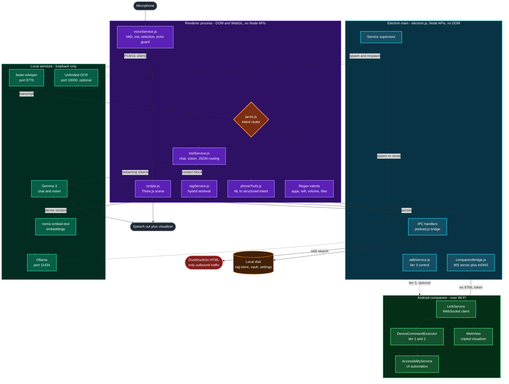
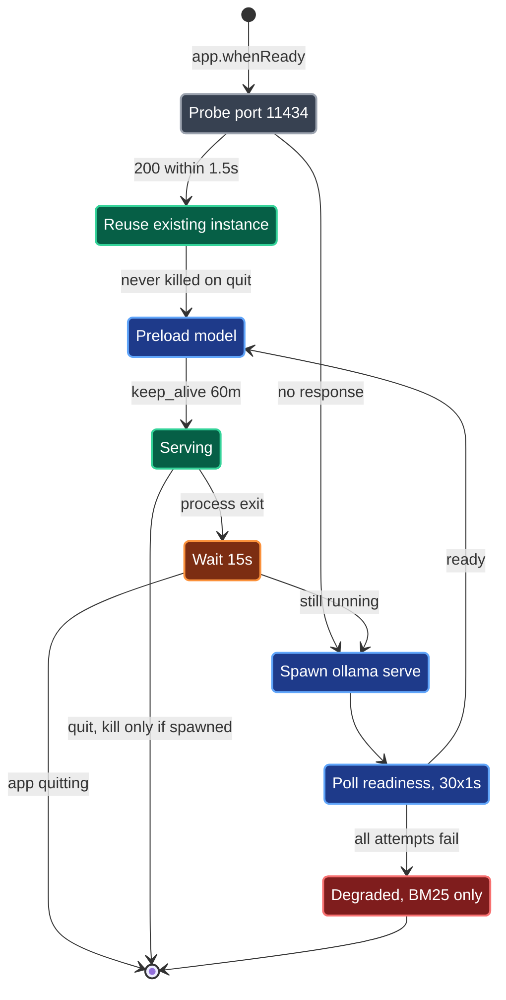
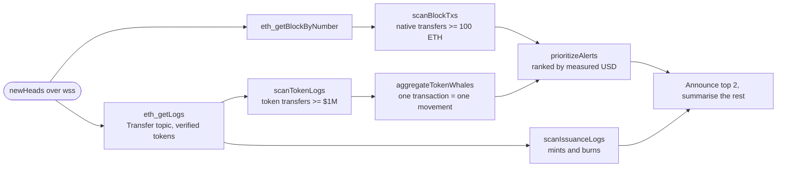
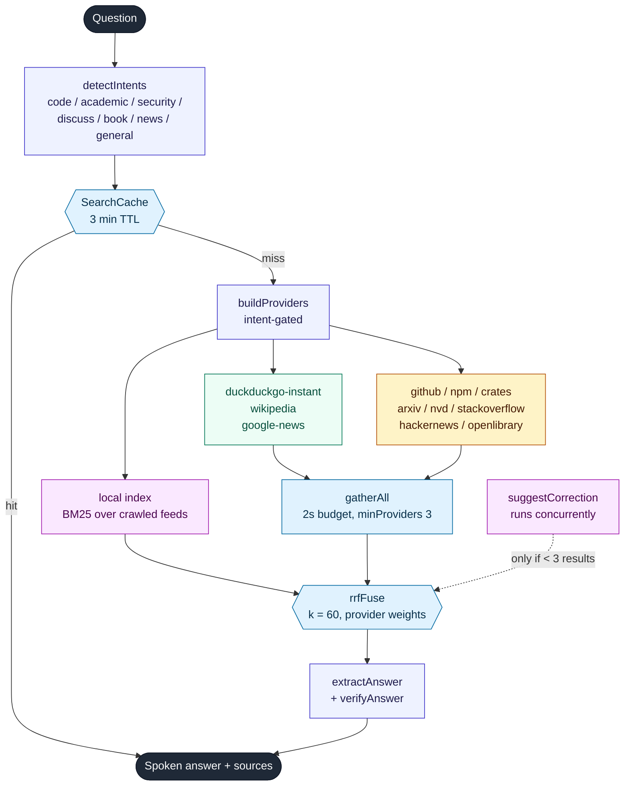
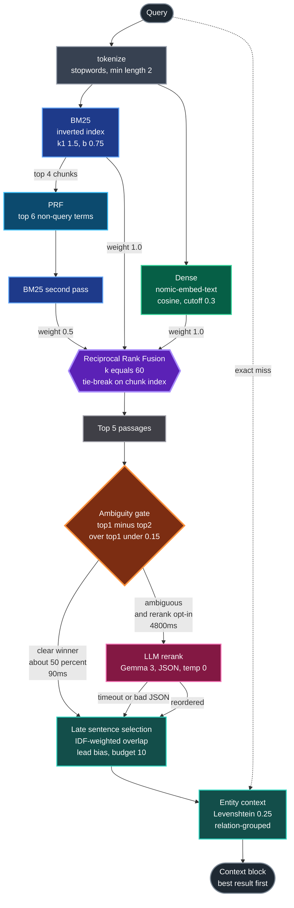

# Architecture diagrams

Extracted from the README because npmjs.com does not render mermaid —
on the package page these appeared as raw code. GitHub renders them here.

## 1. System overview

## 2. Voice pipeline

```mermaid
flowchart LR
    A(["Microphone"]):::io --> B["_pickMicDevice<br/>excludes loopback<br/>ranks headset, internal"]:::step
    B --> C["AudioContext graph<br/>highpass 80Hz<br/>compressor"]:::step
    C --> D["Analyser<br/>FFT bands"]:::viz
    C --> E["capture-processor<br/>PCM16 16kHz"]:::step
    D -->|"bass, mid, treble"| F["Three.js orb<br/>vertex displacement"]:::viz

    E --> G{"Adaptive VAD<br/>3x noise floor"}:::gate
    G -->|"below threshold"| H["Discard"]:::drop
    G -->|"speech detected"| I["Buffer<br/>320ms preroll<br/>1.44s hangover"]:::step
    I --> J["faster-whisper<br/>ws 8770"]:::ai
    J --> K{"Echo guard<br/>60 percent overlap<br/>with spoken text"}:::gate
    K -->|"self-talk"| L["Drop, show ECHO IGNORED"]:::drop
    K -->|"user speech"| M["processCommand"]:::router
    M --> N["Streaming TTS<br/>speak per sentence"]:::step
    N -.->|"sets ttsActive<br/>gates mic"| G
    N -.->|"_rememberSpoken"| K

    classDef io fill:#1f2933,stroke:#7b8794,stroke-width:2px,color:#ffffff
    classDef step fill:#5b21b6,stroke:#a78bfa,stroke-width:2px,color:#ffffff
    classDef gate fill:#7c2d12,stroke:#fb923c,stroke-width:3px,color:#ffffff
    classDef ai fill:#065f46,stroke:#34d399,stroke-width:2px,color:#ffffff
    classDef viz fill:#0c4a6e,stroke:#38bdf8,stroke-width:2px,color:#ffffff
    classDef drop fill:#450a0a,stroke:#ef4444,stroke-width:2px,color:#ffffff
    classDef router fill:#134e4a,stroke:#2dd4bf,stroke-width:2px,color:#ffffff
```

## 3. Process supervision

## 4. Real-time whale stream

## 5. Pipeline

## 6. Retrieval engine

## 7. Pairing

```mermaid
sequenceDiagram
    autonumber
    actor U as User
    participant D as Desktop<br/>electron.js
    participant B as Bridge<br/>port 8765
    participant P as Phone<br/>LinkService
    participant W as WebSocket<br/>port 8766

    rect rgb(46, 16, 101)
    Note over U,D: Onboarding, once per device
    U->>D: "Jarvis, connect to my mobile"
    D->>B: openPairingWindow, 5 minutes
    D-->>U: QR code on HUD
    U->>P: scan with camera
    P->>B: GET /install
    B-->>P: landing page
    P->>B: GET /apk
    B-->>P: app-debug.apk
    U->>P: tap Install, then open
    end

    rect rgb(2, 44, 34)
    Note over P,W: Discovery and pairing, automatic
    P->>P: NSD discover _jarvis._tcp
    B-->>P: resolved, filtered addresses
    Note right of P: drops 169.254.x<br/>and 192.168.56.x
    P->>B: POST /pair
    alt window still open
        B-->>P: 200 token plus wsPort
    else window closed
        B-->>P: 403 pairing window is closed
        Note right of P: retry every 10s
    end
    end

    rect rgb(8, 51, 68)
    Note over P,W: Persistent link
    P->>W: connect, X-Jarvis-Token
    W->>W: timingSafeEqual
    alt token valid
        W-->>P: accepted
        P->>W: hello plus capabilities
        W-->>D: companion-devices event
        D-->>U: "Linked: Xiaomi M2101K6P"
    else token invalid
        W-->>P: close 4001
    end
    end

    rect rgb(19, 78, 74)
    Note over U,W: Steady state
    U->>D: "open settings on my phone"
    D->>D: routePhoneCommand
    D->>W: id, open_app_by_name, name settings
    W->>P: forward
    P->>P: resolve name to package
    P-->>W: ok, com.android.settings
    W-->>D: result
    D-->>U: "Settings is now open on your phone, Sir."
    end

    Note over P,W: on disconnect, reconnect with<br/>exponential backoff capped at 30s
```

